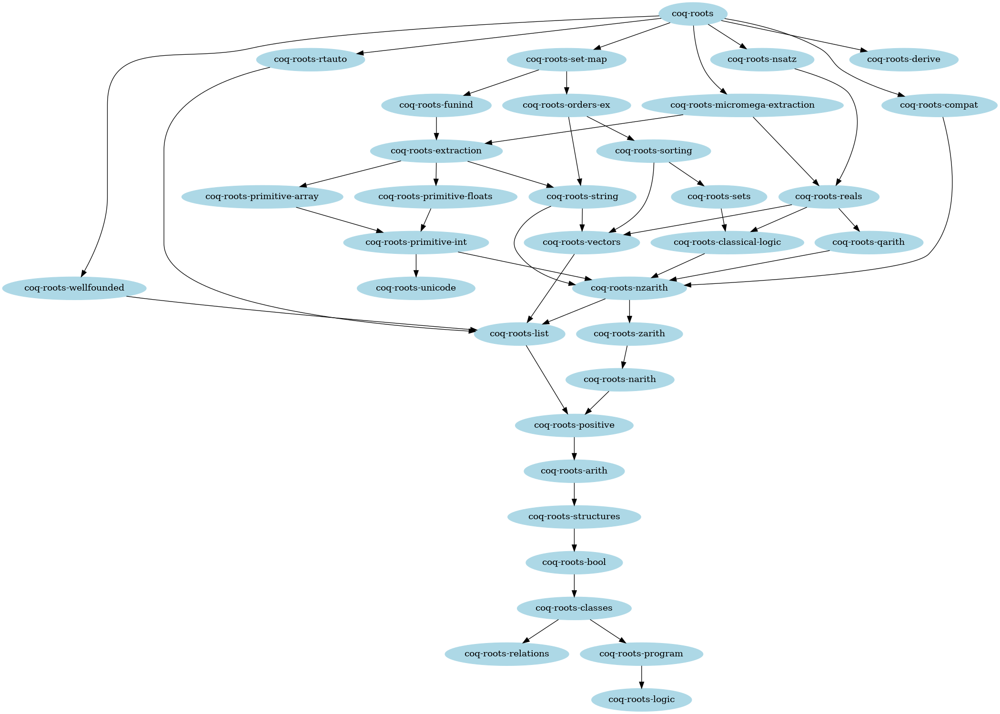

Proof of concept for making the standard library of Coq a regular
library and splitting it into packages.

Dependencies
-----------

This compiles on top of Coq without stdlib as in
https://github.com/proux01/coq/tree/split_stdlib
to compile it:
```shell
% git clone https://github.com/proux01/coq
% git checkout split_stdlib
% make dunestrap
% dune build -p coq-core,coq-stdlib @install
% dune install coq-core coq-stdlib
```
(where `coq-stdlib` is actually just the prelude `Coq.Init`)

Compilation
-----------

Just type `make` to build the whole thing or `make package` to compile
a single package (once its dependencies are installed), then `make
install-package` to install it. `package` being one of
* arith-base
* bool
* classes
* classical-logic
* compat
* derive
* extraction-base
* extraction
* funind
* list
* logic
* nsatz
* narith
* zarith-base
* ring
* arith
* lia
* zarith
* orders-ex
* positive
* primitive-array
* primitive-floats
* primitive-int
* program
* qarith-base
* field
* lqa
* qarith
* reals
* relations
* rtauto
* fmaps-fsets-msets
* sets
* sorting
* streams
* string
* structures
* unicode
* vectors
* wellfounded

and where the dependencies are as follows:

